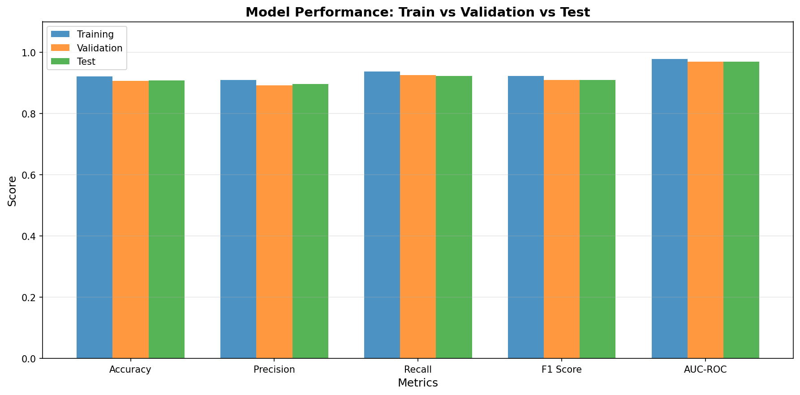
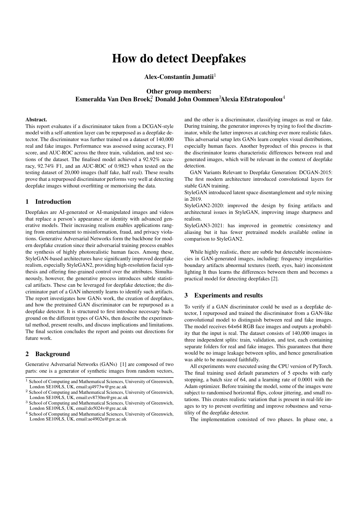
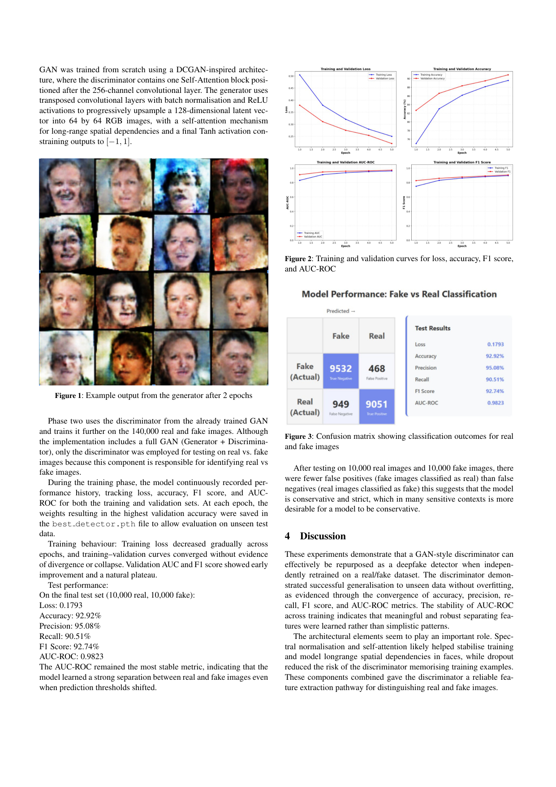
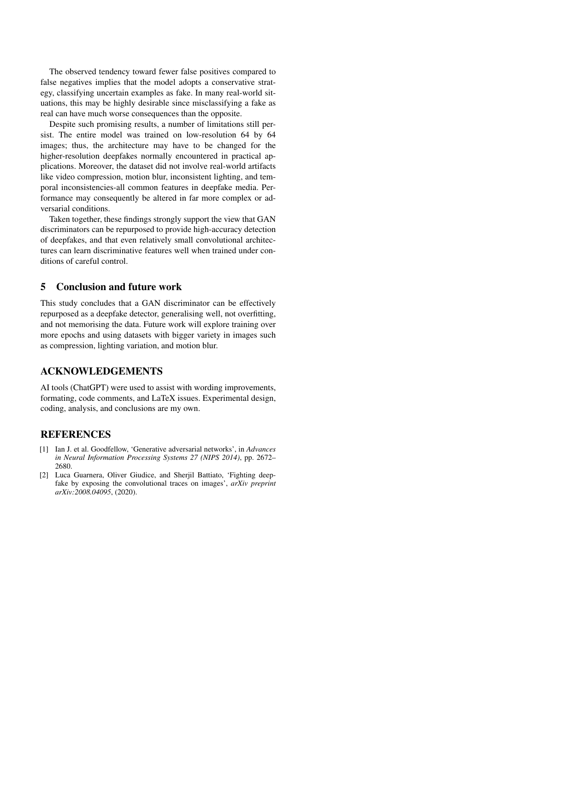

# Deepfake Face Detector

A GAN discriminator, repurposed and fine-tuned to tell real photos of faces
apart from AI-generated ones — 92.9% accuracy and 0.982 AUC-ROC on a held-out
test set of 20,000 images.

**[Try the live demo →](https://deepfake-detection-l69f.onrender.com)**
*(hosted on a free tier — the first load can take up to a minute to wake up)*



## Overview

Modern GANs generate convincingly realistic faces, but the adversarial
training process that produces them also produces a byproduct: a
discriminator network that has learned exactly what separates real images
from generated ones. This project tests that idea directly — a DCGAN-style
discriminator with self-attention and spectral normalization is trained
from scratch as part of a full GAN, then fine-tuned as a standalone binary
classifier on the
[140k Real and Fake Faces](https://www.kaggle.com/datasets/xhlulu/140k-real-and-fake-faces)
dataset.

| Split      | Accuracy | Precision | Recall | F1     | AUC-ROC |
|------------|---------:|----------:|-------:|-------:|--------:|
| **Test**   | **92.92%** | 95.08%  | 90.51% | 92.74% | 0.9823  |
| Validation | 90.71%   | 89.20%    | 92.62% | 90.88% | 0.9697  |
| Train      | 92.17%   | 90.92%    | 93.70% | 92.29% | 0.9776  |

100,000 training / 20,000 validation / 20,000 test images, balanced
real/fake with no leakage between splits. Full metrics in
[`models/evaluation_metrics.json`](./models/evaluation_metrics.json).

## How it works

1. **Adversarial pretraining** — a generator and discriminator are trained
   from scratch as a standard GAN on 64×64 face images, so the
   discriminator first learns to spot generated images the hard way: by
   competing against a generator that's actively trying to fool it.
2. **Supervised fine-tuning** — the best discriminator checkpoint from
   phase one is then fine-tuned directly as a real/fake classifier on the
   labeled dataset.
3. Only the discriminator is used at inference time.

## Web demo

A [Gradio](https://gradio.app) app in [`huggingface_space/`](./huggingface_space)
loads the trained model and classifies any uploaded image as Real or
AI-Generated with a confidence score. Run it locally:

```bash
cd huggingface_space
pip install -r requirements.txt
python app.py
```

## Report

Full write-up (background, method, results, limitations, and future work):
[`001366584_COMP1827_REPORT.pdf`](./001366584_COMP1827_REPORT.pdf)

<p align="center">
  
  
  
</p>

## Project structure

```
detector.py             Training and evaluation pipeline
huggingface_space/       Gradio web demo
data/                    Dataset (train/val/test, each with real/ and fake/)
models/                  Trained checkpoints and evaluation results
plots/                   Training curves and metric plots
generated_images/        Sample generator outputs during training
```

## Getting started

```bash
pip install -r requirements.txt

# Train from scratch (both phases) and evaluate on all splits
python detector.py --mode train --data_dir data --epochs 20 --batch_size 32

# Or just evaluate an existing checkpoint on the test set
python detector.py --mode evaluate --model_path models/best_detector.pth
```

Download the [140k Real and Fake Faces](https://www.kaggle.com/datasets/xhlulu/140k-real-and-fake-faces)
dataset and arrange it as:

```
data/
├── train/{real,fake}/
├── val/{real,fake}/
└── test/{real,fake}/
```

## Tech stack

PyTorch · Gradio · scikit-learn · Render (deployment)

## Limitations

Trained on low-resolution (64×64) face crops with no exposure to
real-world artifacts like compression, motion blur, or varied lighting —
accuracy on higher-resolution images or newer generators (e.g. diffusion
models) is untested. Discussed further in the report.

## Acknowledgements

Group project for COMP1827, University of Greenwich — see the report for
the full author list. Dataset: [xhlulu/140k-real-and-fake-faces](https://www.kaggle.com/datasets/xhlulu/140k-real-and-fake-faces)
on Kaggle.
